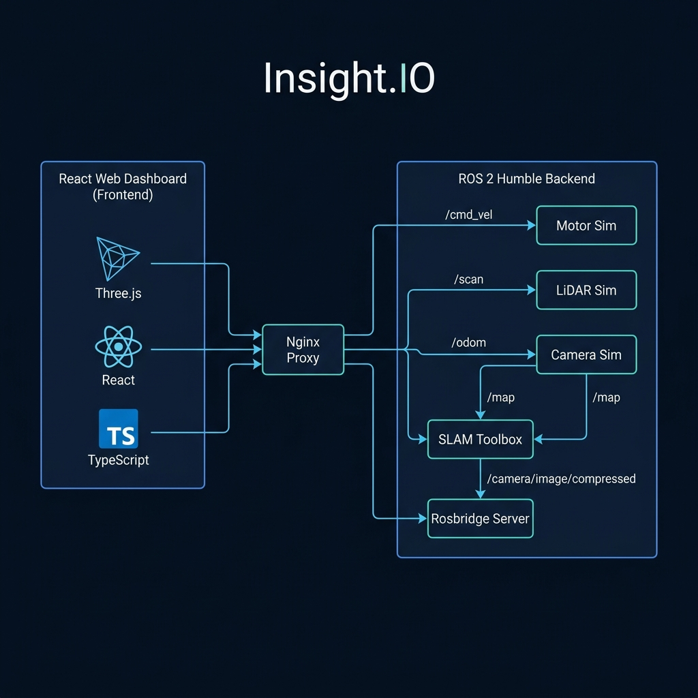
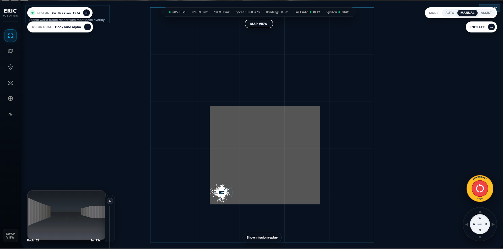
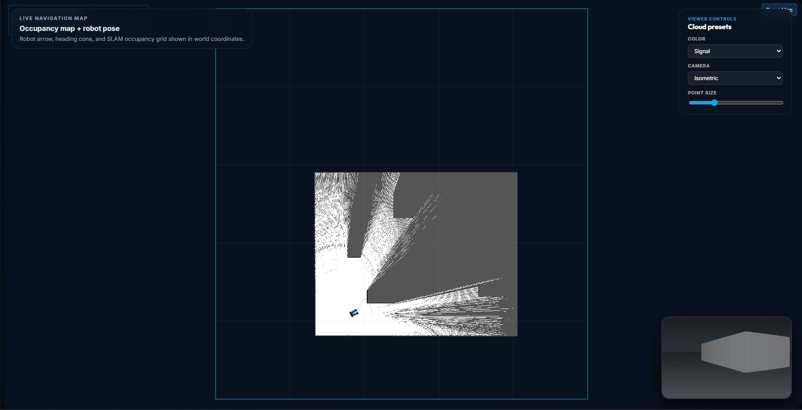
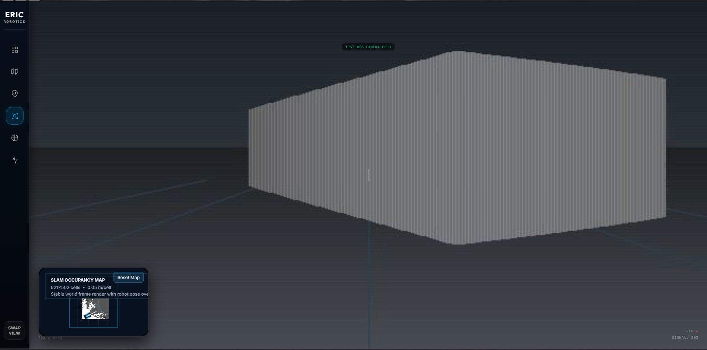
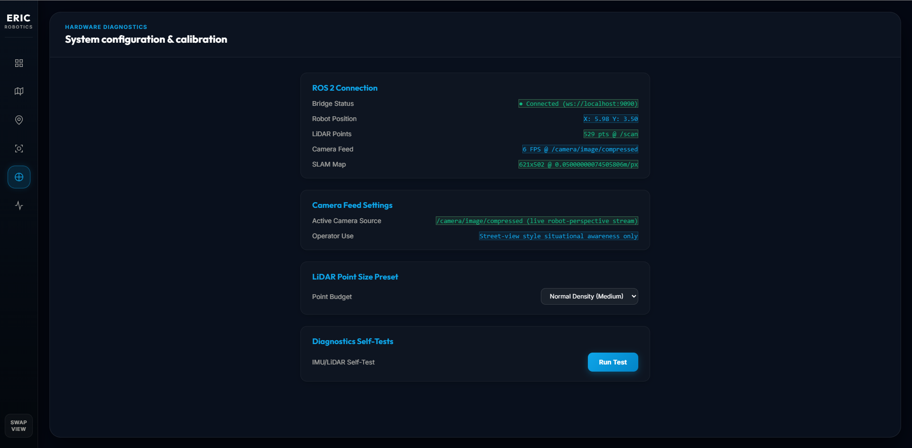
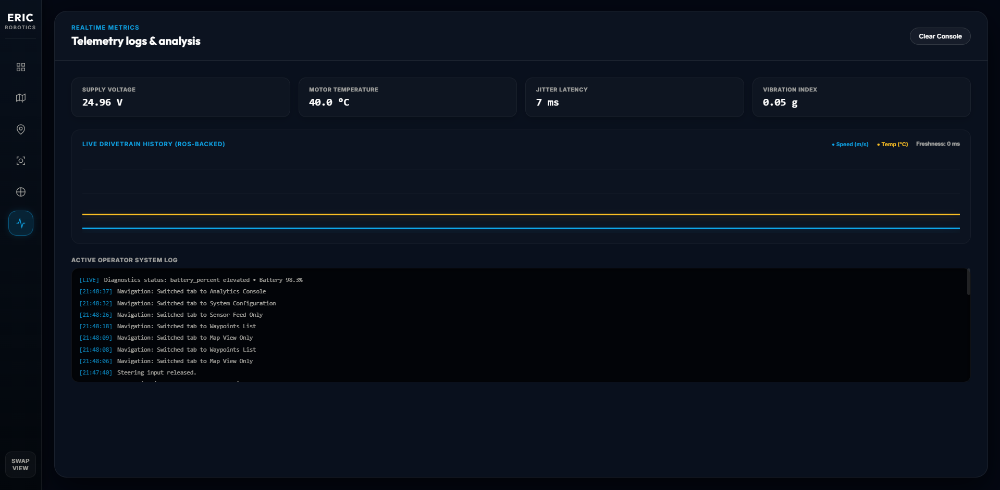
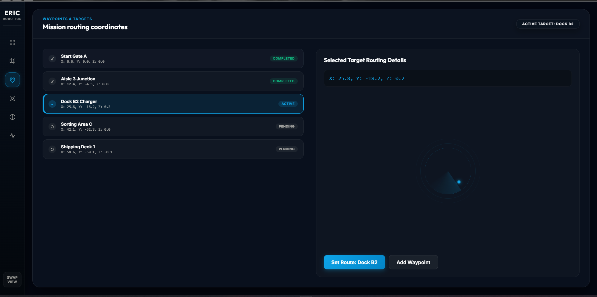
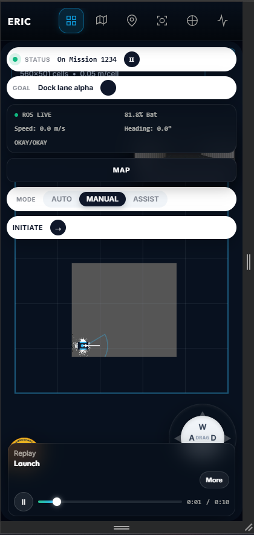
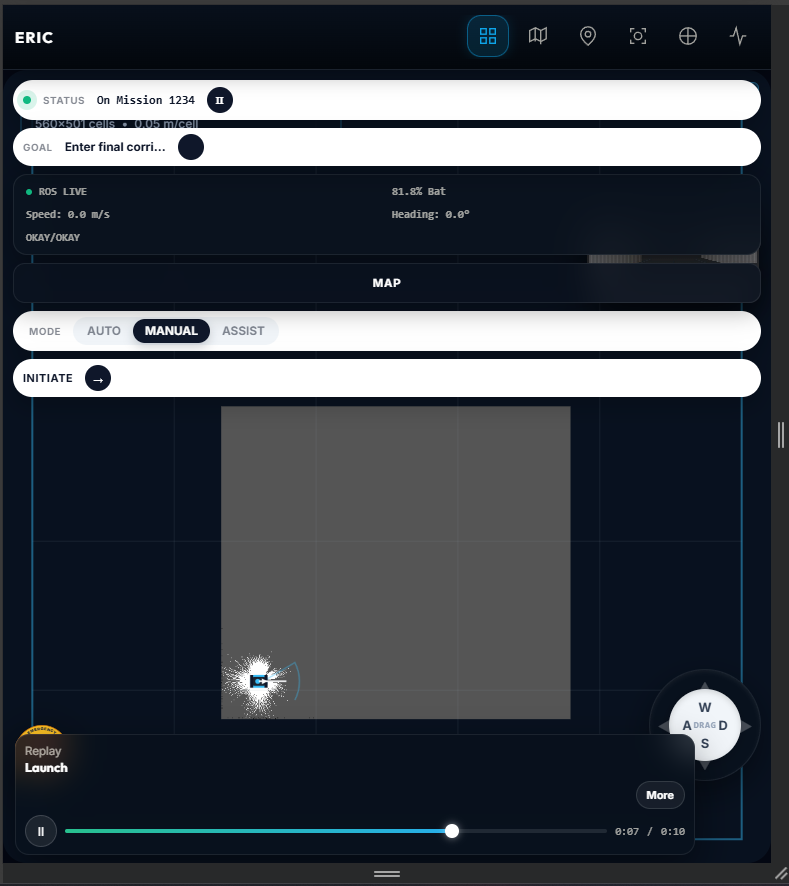

# FSD Assignment #1 Report: Insight.IO Operator Dashboard
**Candidate:** Nilesh Kowe  
**Role Applied:** Full-Stack Developer (Robotics & Dashboard Systems)  
**Project Location:** [Assignment - ERIC Robotics](file:///F:/hermes/projects/Assignment%20-%20ERIC%20Robotics/681ec28e49cbdfeabb03a784ce838ff1-58711edafc6b1734880ace5a8b339bc0b2dfef70)

---

## 1. Executive Summary

This report documents the implementation of the **`Insight.IO`** operator dashboard, a responsive, real-time interface designed to monitor and control autonomous mobile robots (AMRs) in warehouse environments. 

The dashboard provides operators with situational awareness through:
1. **3D Point Cloud View**: A real-time 3D lidar point cloud rendering using Three.js.
2. **SLAM Mapping**: An interactive 2D occupancy grid mapping component powered by ROS 2 `slam_toolbox`.
3. **Camera View**: A streaming compressed video feed showing the robot's perspective.
4. **Teleoperation Hub**: Keyboard (WASD) and touch-based joystick publishing velocity controls.
5. **Waypoints Controller**: A sequential mission router displaying target coordinates and heading.
6. **Telemetry & Live Diagnostics**: A terminal log console and real-time visualization of voltage, speed, and hardware status.

The system is fully containerized using Docker, allowing a one-click deployment on both Windows (PowerShell/CMD) and Linux (Bash). A local demo fallback is included to allow evaluation without a running ROS 2 environment.

---

## 2. System Architecture

The project is structured with a clean separation of concerns, dividing the frontend dashboard, the proxy server, and the ROS 2 simulation backend.

### Architecture Diagram
The following diagram illustrates the deployment topology, communication channels, and ROS 2 topic routing:

### Architectural Layers

#### 1. Frontend: React 19 Dashboard
- **Framework**: Built with React 19, TypeScript, and Vite.
- **Data Flow**: Subscribes to telemetry, scan, map, and camera topics; publishes velocity (`/cmd_vel`) and navigation targets.
- **3D Engine**: Uses Three.js (WebGL) to parse and render 3D LiDAR point clouds dynamically.
- **ROS Connection**: Communicates via WebSockets using `roslibjs`, encapsulating connections in custom React hooks for modularity.

#### 2. Network Proxy: Nginx
- **Function**: Serves static frontend assets and acts as a reverse proxy for WebSocket traffic.
- **Same-Origin Routing**: Maps incoming client WebSocket connections from `/rosbridge` to the backend ROS bridge service on port `9090`. This eliminates hardcoded localhost references, facilitating cross-device access (e.g., loading the dashboard on a mobile phone over local Wi-Fi).

#### 3. Backend: ROS 2 Humble Stack (Dockerized)
- **`robot_motor_node`**: Simulates differential-drive kinematics, accepting `/cmd_vel` velocity inputs and publishing `/odom` odometry and TF transforms.
- **`velodyne_sim_node`**: Generates simulated Velodyne VLP-16 scan points, ray-casting against a YAML-defined warehouse layout, and publishes `/velodyne_points` and `/scan`.
- **`camera_stream_node`**: Streams a simulated top-down warehouse or perspective view to `/camera/image/compressed`.
- **`slam_toolbox`**: Evaluates active lidar scans and updates the global occupancy grid map on `/map`.
- **`rosbridge_server`**: Translates native ROS 2 topics to WebSockets.

---

## 3. Detailed Component Walkthrough

### 3.1 Main Dashboard & Layout Switching (Hero Shot)
The default view balances a grid of components centered around the **Map View**. A side navigation bar allows quick switching between specialized pages. A viewport-swapping feature (`M` key or bottom-left "SWAP VIEW" button) interchanges the main screen with the picture-in-picture (PiP) feed, allowing the operator to focus on camera navigation or map inspection.

---

### 3.2 SLAM Map View (Occupancy Grid)
The map view displays the occupancy grid map compiled by `slam_toolbox`. It overlays the robot's real-time position, its orientation arrow, and a transparent heading cone representing the camera field-of-view. 

- **Resolution**: 0.05m per cell.
- **Interactions**: Operators can reset the map accumulator or adjust zoom levels.

---

### 3.3 Live Camera Feed
The camera feed component decodes raw JPEG payloads from `/camera/image/compressed` at 6 FPS. In offline demo mode, it falls back to a loop-played MP4 video file. Swapping to full-screen mode provides maximum situational awareness for manual teleoperation.

---

### 3.4 Hardware Diagnostics & Calibration
This panel lists active ROS 2 topics, connection status, subscription speeds (FPS/Hz), and calibrated values. It allows configuration of the LiDAR point density (budget) and includes an IMU/LiDAR self-test control.

---

### 3.5 Telemetry Logs & Real-Time Analytics
This console displays real-time telemetry variables (voltage, motor temperature, network jitter, vibration indices) alongside SVG-based scrolling timelines tracking speed and thermal history. The bottom section streams a live console log documenting operator actions and system state shifts.

---

### 3.6 Waypoint Mission Routing
The waypoints system controls sequential coordinates routing. It monitors a queue of five target waypoints (Start Gate, Aisle 3 Junction, Dock B2 Charger, Sorting Area, Shipping Deck) and details active coordinates (X, Y, Z) beside an SVG radar compass indicating direction relative to the robot's pose.

---

### 3.7 Responsive & Mobile Viewports
The interface is designed using CSS Grid and Flexbox to adapt seamlessly to mobile viewports. On smaller screens, the side navigation rail shifts to a top header, and widgets stack vertically to remain fully interactive. Teleoperation can be conducted using touch controls via an integrated virtual joystick.

| Mobile View - Initialization | Mobile View - Mission Progress |
|:---:|:---:|
|  |  |

---

## 4. Design Decisions & Engineering Trade-offs

1. **Lightweight Simulation (No Gazebo/Webots)**
   - *Decision*: A custom geometry raycaster (`world_model.py`) simulates distance scanning based on a 2D line segment database.
   - *Rationale*: Avoids heavy GPU dependencies and rendering bottlenecks. The entire simulator compiles and runs inside a Docker container, requiring less than 50MB of RAM and minimal CPU resources.

2. **Unified LiDAR Node**
   - *Decision*: The simulated LiDAR node publishes both `sensor_msgs/msg/LaserScan` (`/scan`) and `sensor_msgs/msg/PointCloud2` (`/velodyne_points`) directly.
   - *Rationale*: Eliminates the overhead of spawning an additional `pointcloud_to_laserscan` ROS node, streamlining the compute pipeline.

3. **Deadman Safety Protocol**
   - *Decision*: Spawns a heartbeat watchdog in `useCmdVelPublisher.ts` that publishes zero-velocity vectors if the joystick or WASD controls remain idle for more than 300ms.
   - *Rationale*: Protects the physical or simulated system from running wild if network latency causes connection loss or browser crash during manual drive.

4. **Nginx Reverse-Proxy Integration**
   - *Decision*: Utilized Nginx inside a dedicated production container to proxy `/rosbridge` to `ws://eric-ros2:9090`.
   - *Rationale*: Solves cross-origin and network resolution limitations, allowing remote tablets/phones on the same Wi-Fi subnet to access both the web UI and live ROS data stream without configuration changes.

---

## 5. Setup & Execution Guide

### Option A: Docker Compose Stack (Recommended Local)
This runs the full simulation and ROS 2 network backend locally.
1. Ensure Docker Desktop is installed and running.
2. Run the main launch script in the project root:
   - **Windows (CMD/PowerShell)**: Double-click `run.bat` or run `.\setup.ps1`
   - **Linux/macOS/WSL**: `./setup.sh`
3. Access the dashboard at `http://localhost:8080`.

### Option B: Offline Demo Fallback (Local)
If Docker is unavailable, the dashboard can be executed locally in static mode.
1. Ensure Node.js (18+) is installed.
2. Start the local development server:
   - **Windows**: `.\setup.ps1 -Mode frontend`
   - **Linux/macOS**: `./setup.sh --frontend-only`
3. Access the frontend at `http://localhost:5173`.

### Option C: Cloud Deployment (Railway.app)
The complete stack (both React frontend and ROS 2 simulation backend) can be deployed to the cloud for demonstration. Nginx proxies WebSocket traffic securely within Railway's private network, eliminating the need for local hosting or Cloudflare tunnels.
- For a step-by-step setup walkthrough, see the [docs/DEPLOYMENT_GUIDE.md](file:///F:/hermes/projects/Assignment%20-%20ERIC%20Robotics/681ec28e49cbdfeabb03a784ce838ff1-58711edafc6b1734880ace5a8b339bc0b2dfef70/docs/DEPLOYMENT_GUIDE.md).

