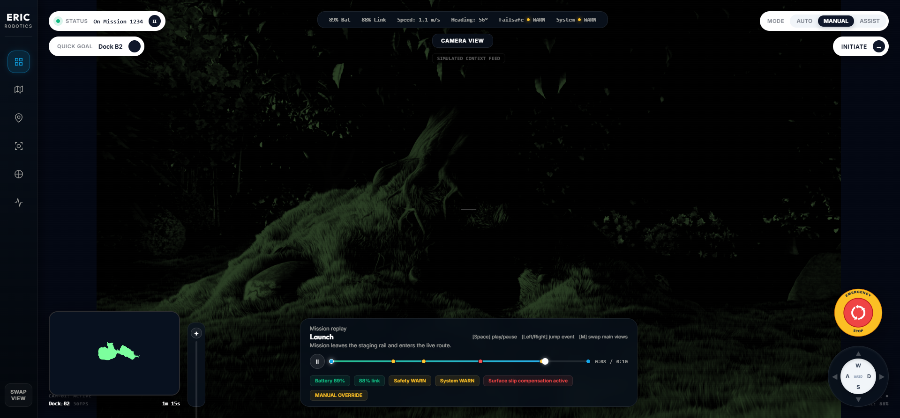

# Insight.IO Assignment Delivery

Self-hosted `React + TypeScript + Vite 8` recreation of the ERIC Robotics `Insight.IO` dashboard reference. The app runs fully offline after `npm install`, uses a bundled MP4 for the main camera surface, renders a local `.pcd` file in-browser with Three.js, and includes a replay-driven telemetry layer for status changes and event jumps.



## Stack

- React 19
- TypeScript 5
- Vite 8.0.14
- Three.js 0.184 with `PCDLoader` and `OrbitControls`

## Setup

```bash
npm install
npm run dev
```

The default dev server is Vite's local server. For a production-style run:

```bash
npm run build
npm run preview
```

## Offline Runtime

All runtime assets are bundled in `public/assets/`:

- `camera-feed.mp4`
- `map-cloud.pcd`
- `reference-frame.png`
- `telemetry.json`
- `mission-events.json`

After dependencies are installed once, the dashboard does not require network access to run.

## Controls

- `Space`: play or pause the mission replay
- `Left Arrow`: jump to previous mission event
- `Right Arrow`: jump to next mission event
- `M`: hide or reopen the 3D map panel

## Architecture Notes

- `src/App.tsx` owns the operator layout, local asset loading, camera overlay UI, and replay timeline.
- `src/hooks/useMissionReplay.ts` separates replay state from presentation so the UI can scrub, jump, and animate without mixing control logic into view code.
- `src/components/PointCloudPanel.tsx` mounts a Three.js scene once, loads the PCD with `PCDLoader`, and pauses render work when the panel is hidden.
- `src/types.ts` keeps telemetry, events, modes, and viewer controls typed and explicit.

## Design Decisions

- **Full-Viewport Swapping Architecture**: The dashboard positions the active primary view (Map or Camera Feed) as a fullscreen background with secondary views and controls floating on top. A picture-in-picture (PiP) window in the lower-left lets the operator swap primary/secondary views with a single click, automatically resizing WebGL canvases and video bounds.
- **Custom-Designed SVG Widgets**:
  - **Emergency Stop**: Built an industrial-style E-Stop button from scratch using inline SVGs, featuring text-path curves ("EMERGENCY STOP"), red-gradient core fills, white circular arrow markers, and active warning pulse animation loops.
  - **WASD Gamepad**: Formatted a sleek, slate-dark gamepad that lights up arrow states and letter buttons dynamically in response to keyboard keydown/keyup events (W, A, S, D) or direct mouse clicks.
- **Dynamic Telemetry & Graphics**:
  - **Real-Time SVG Waveform Charts**: AUTHOR-level telemetry data plots Speed (cyan) and Motor Temperature (amber) dynamically into an animated SVG line chart, reading from a rolling 30-frame history as the mission time scrubbing happens.
  - **Waypoints Sweep Radar**: The Waypoints tab displays a custom target compass modeled using conic-gradients to animate a scanning radar sweep that moves a tracking vector pointer relative to the active target.
- **Cinematic styling**: Overhauled styling in CSS using imported Google Fonts (`Outfit` and `Inter`), slate-dark gradients, and glassmorphic panels (`backdrop-filter: blur(16px)`), giving the application a clean, industrial, and symmetric look.

## Asset Provenance

- Reference still: provided local capture derived from the assignment reference GIF
- Camera video: `Big Buck Bunny` 10s MP4 from `test-videos.co.uk`
- Point cloud: `Zaghetto.pcd` from the official Three.js example assets
- Telemetry and mission event fixtures: authored locally for this submission

## Verification

Verified locally with:

- `npm run lint`
- `npm run build`

## Notes

- The production bundle is larger than the default Vite chunk warning threshold because Three.js and the point cloud loader live in the same client bundle. This is acceptable for the assignment deliverable, but code-splitting the 3D panel would be the next optimization pass.
